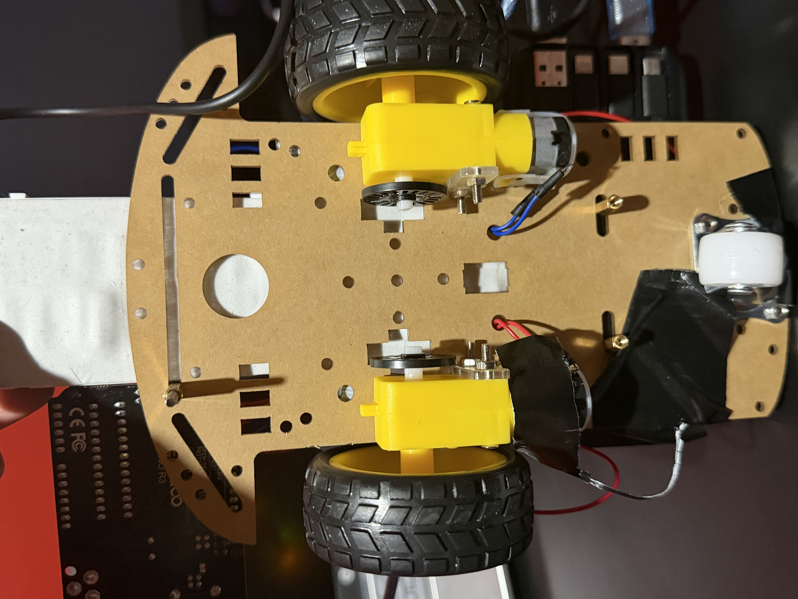
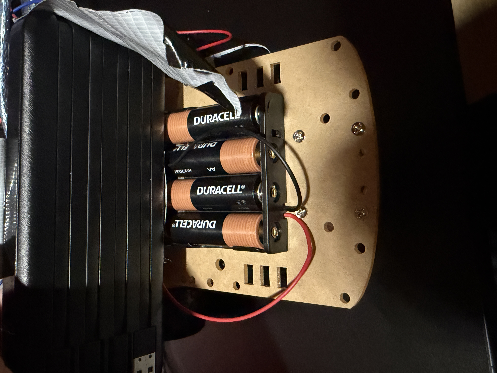

# ESP32 WiFi-Controlled 2WD Rover

A wireless two-wheel drive rover controlled over WiFi via a web browser interface. Built on a 2WD chassis with an Arduino Uno handling motor control and system logic, and an ESP32-S3 acting as a WiFi access point and HTTP server. Communication between the two microcontrollers uses UART serial. System state and battery information are displayed on an onboard OLED screen.

First real robotics system — untethered, wireless, and fully modular.

## Features
- WiFi HTTP server on ESP32-S3 for wireless browser-based control
- UART communication between ESP32-S3 and Arduino Uno
- I2C OLED display showing drive mode and live battery voltage and percentage
- Dual DC motor control via TB6612FNG H-bridge driver
- Real-time battery voltage monitoring using ADC averaging and voltage divider
- Separated logic power (5V USB power bank) and motor power (4× AA battery pack)
- Modular firmware architecture across dedicated driver files

## Hardware
- Arduino Uno — main logic controller
- ESP32-S3-WROOM-1 N16R8 — WiFi server and wireless interface
- TB6612FNG dual motor driver
- 2× TT DC gear motors
- SSD1306 128×64 OLED display (I2C)
- 4× AA battery holder (motor power)
- 5V USB power bank (logic power)
- 2WD rover chassis
- Breadboard + jumper wires

## System Architecture

```
Browser (phone/PC)
       │
       │ HTTP over WiFi
       ▼
  ESP32-S3
  WiFi HTTP Server
       │
       │ UART Serial (TX → Arduino pin 12)
       ▼
  Arduino Uno
  App Logic + Motor Control
       │                    │
       ▼                    ▼
TB6612FNG              SSD1306 OLED
Motor Driver           I2C Display
  │      │
Motor A  Motor B
```

## Communication Protocols Used
- **WiFi HTTP** — ESP32-S3 hosts a TCP server on port 80. Browser sends GET requests to `/F`, `/R`, or `/S`. ESP32 parses the request line and sends a single character command over UART.
- **UART** — Single-byte commands (`F`, `R`, `S`) sent from ESP32-S3 TX to Arduino via SoftwareSerial on pins 11/12.
- **I2C** — OLED display connected to Arduino SDA/SCL via Wire library.

## Drive Modes
| Command | Mode | Behavior |
|---------|------|----------|
| F | Drive | Both motors forward at PWM 150 |
| R | Reverse | Both motors reverse at PWM 150 |
| S | Park | Motors stopped |

## Battery Monitoring
A voltage divider using two 10kΩ resistors on analog pin A0 halves the battery voltage before it reaches the ADC, keeping it within the Arduino's 0–5V input range. 20 samples are averaged per reading to reduce noise. The firmware doubles the reading back to recover actual battery voltage.

```
Battery+ → R1 → A0 → R2 → GND
Vout = Vbattery × R2 / (R1 + R2)
Vbattery = Vout × 2.0  (for equal R1/R2)
```

Battery percentage is mapped between 4.8V (0%) and 6.85V (100%) for a 4× AA pack.

## Wiring

**TB6612FNG → Arduino**
```
PWMA  → Pin 9
AIN1  → Pin 7
AIN2  → Pin 6
BIN1  → Pin 4
BIN2  → Pin 3
PWMB  → Pin 10
STBY  → Pin 8
```

**TB6612FNG → Motors**
```
AO1, AO2 → Motor A terminals
BO1, BO2 → Motor B terminals
VM       → 4× AA battery pack positive
GND      → shared ground
```

**Motors → TB6612FNG**
```
Motor terminal holes → jumper wire pins bent through and connected to AO1/AO2 and BO1/BO2
(prototype connection — solder directly to motor tabs for permanent builds)
```

**OLED → Arduino**
```
SDA → A4
SCL → A5
VCC → 3.3V or 5V
GND → GND
```

**ESP32-S3 → Arduino**
```
ESP32 TX (GPIO17) → Arduino pin 12 (SoftwareSerial RX)
Shared GND
```

**Battery Monitor**
```
Battery+ → voltage divider → A0
Divider: two equal resistors to GND
```

**Power**
```
Logic power:  5V USB power bank → Arduino VIN
Motor power:  4× AA pack → TB6612FNG VM
Shared GND across all components
```

## Firmware Structure
```
main.ino          → setup() and loop() only
app_logic         → system orchestration, battery monitoring
motor_driver      → TB6612FNG control, DriveMode enum
OLED_driver       → SSD1306 display abstraction
```

## Build Photos

### Full rover — top view


### Rover on desk


### Arduino Uno + ESP32-S3 close-up


### Wiring and TB6612FNG motor driver


### OLED display showing live battery and gear state


### Underside — motors and chassis


### Motor wire routing


### Motor battery pack — 4× AA Duracell



## Known Limitations
- **HTTP server blocks during client handling** — `readStringUntil()` blocks the ESP32 loop while reading the HTTP request. Commands cannot be received during this window. An async HTTP server would resolve this.
- **SoftwareSerial** — software UART emulation on Arduino pins 11/12 can miss bytes under interrupt load. Hardware UART on pins 0/1 would be more reliable but conflicts with USB serial during development.
- **OLED redraws every loop** — display is cleared and redrawn on every iteration causing minor flicker. Redrawing only on state change would improve this.

## Future Improvements
- Replace HTTP polling with WebSocket for continuous low-latency control
- Add ultrasonic sensor for autonomous obstacle avoidance
- Implement variable speed control via web interface slider
- Add encoder feedback for closed-loop speed control
- Migrate to hardware UART for more reliable ESP32-Arduino communication
- Add onboard camera (ESP32-CAM) for FPV view

## Notes
First complete robotics system — untethered wireless rover with separated logic and motor power, live battery monitoring, and multi-protocol communication (WiFi, UART, I2C) across two microcontrollers. Built approximately two weeks after starting electronics from scratch.
